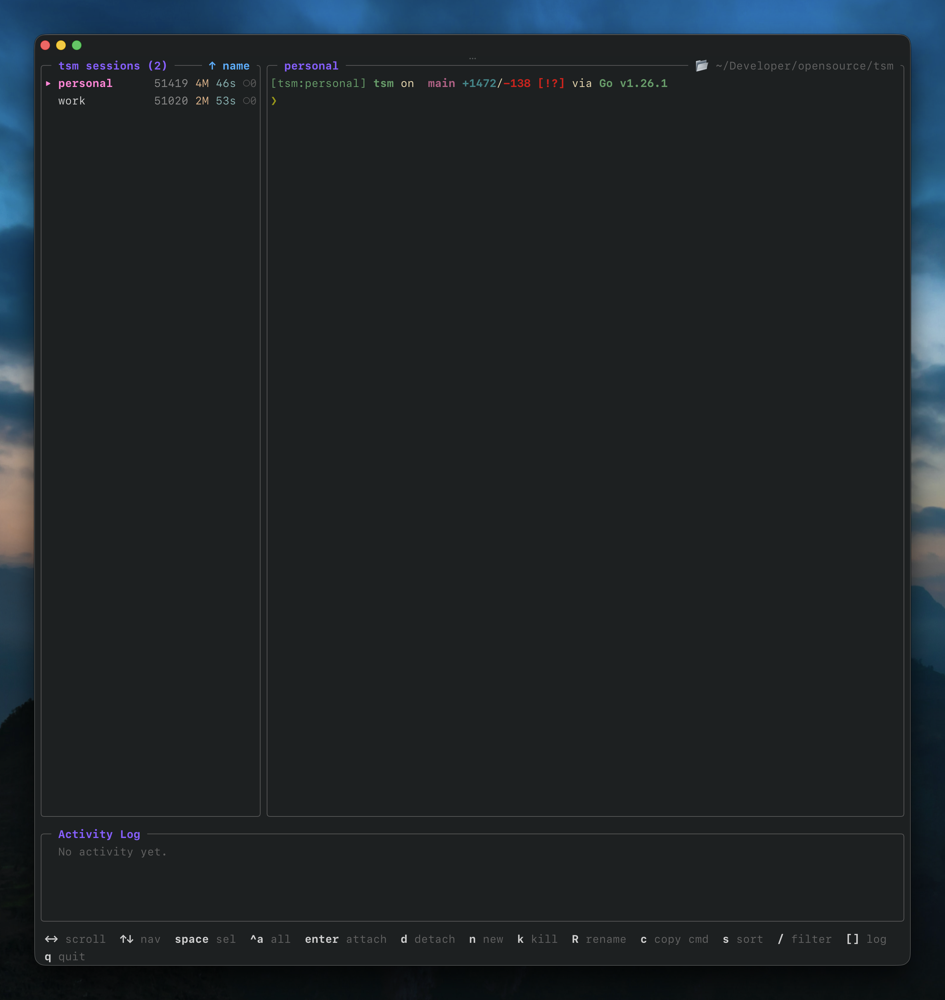
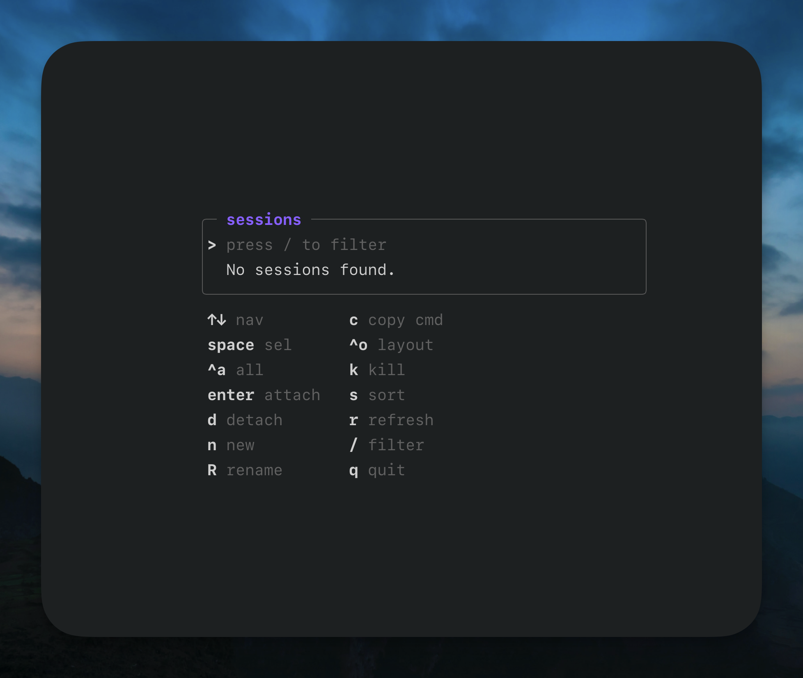
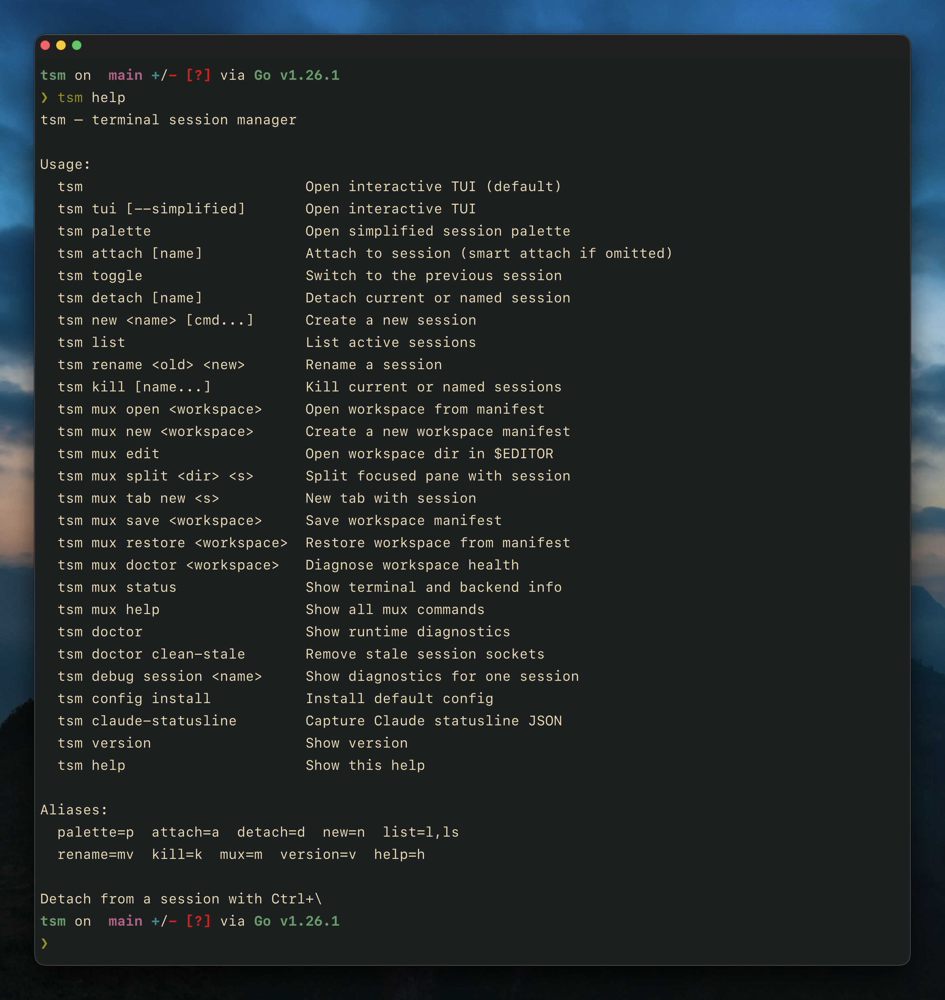

# tsm

`tsm` is a terminal session manager. It keeps shell sessions alive as background daemons, lets you detach and reattach later, and restores terminal state without turning the project into a tmux clone.

It is built around a simple model:

- one daemon per session
- one PTY per session
- no panes, windows, or tabs inside `tsm`
- fast switching between named sessions from the CLI or TUI

For full-screen terminal apps like Neovim, the preferred build uses Ghostty's VT engine so reattach can restore the visible screen instead of only restoring terminal modes.

## Screenshots

Full TUI:



Simplified session palette:



Compact help layout:



## Why TSM

`tsm` is for people who want persistent terminal sessions without adopting tmux's window and pane model.

Use it when you want:

- a long-lived shell or editor per project
- fast switching between sessions
- detach / reattach from anywhere
- a command-palette-style session picker
- quick Codex / Claude activity checks before switching
- full-screen restore for Neovim and similar apps on the Ghostty-backed build

Do not expect `tsm` to manage splits. Splits belong to your shell app or your terminal:

- use Ghostty splits for multiple visible terminals
- use Neovim splits for editor layout
- use multiple `tsm` sessions for multiple long-lived work contexts

## Install

There are two supported install tracks.

| Install path    | Backend         | Best for                                         |
| --------------- | --------------- | ------------------------------------------------ |
| Release archive | `libghostty-vt` | Best restore quality, recommended for most users |
| Homebrew        | `libghostty-vt` | Managed installs and upgrades                    |

### Release archive

This is the recommended install path.

Release archives are self-contained. They bundle:

- `tsm`
- `libghostty-vt`

Users do not need to install Ghostty separately.

Supported bundled release targets:

- macOS `amd64`
- macOS `arm64`
- Linux `amd64`
- Linux `arm64`

Download the matching archive from GitHub Releases, extract it, and place `tsm` on your `PATH`.

### Homebrew

`tsm` is distributed through a custom tap, not `homebrew/core`, so it will not show up in a plain `brew search tsm`.

Install it with the tap-qualified formula name:

```bash
brew tap adibhanna/tsm
brew install adibhanna/tsm/tsm
```

Remove it with:

```bash
brew uninstall adibhanna/tsm/tsm
```

The supported Homebrew path is the self-contained release archive formula published by the release workflow. A source-backed formula is brittle because Ghostty's Zig build fetches external dependencies during the build, which Homebrew may block in its sandbox. Until tagged release archives are published, prefer the source install.

### Build from source

Prerequisites:

- [Go](https://go.dev/dl/) 1.25+
- [Zig](https://ziglang.org/download/) 0.15.2
- `pkg-config` (`brew install pkg-config` on macOS, `apt install pkg-config` on Linux)

```bash
git clone https://github.com/adibhanna/tsm.git
cd tsm
make setup
make build
```

`make setup` verifies prerequisites, clones Ghostty into `./ghostty`, and builds `libghostty-vt` into `./.ghostty-prefix`. After that, `make build`, `make test`, and `make lint` all work.

Install under a user prefix:

```bash
make install
```

That installs:

- `tsm` into `~/.local/bin`
- `libghostty-vt` into `~/.local/lib/tsm`

Remove it cleanly:

```bash
make uninstall
```

Override the install root if needed:

```bash
make install PREFIX=/opt/homebrew
make uninstall PREFIX=/opt/homebrew
```

System-wide install:

```bash
sudo make install PREFIX=/usr/local
sudo make uninstall PREFIX=/usr/local
```

## Quick Start

Create or attach a session:

```bash
tsm attach
```

That command is intentionally smart:

- no sessions: create one named after the current directory and attach
- one session: attach directly
- multiple sessions: open the picker

Create a specific session and start a command inside it:

```bash
tsm new api bash -lc 'npm run dev'
```

Open Neovim in a session:

```bash
tsm attach editor
nvim
```

Detach interactively:

```text
Ctrl+\
```

Reattach later:

```bash
tsm attach editor
```

List sessions:

```bash
tsm ls
```

Run diagnostics:

```bash
tsm doctor
```

## Session Model

Each session is a long-lived daemon with:

- a Unix socket
- a PTY
- a foreground process like `zsh`, `bash`, `fish`, `nvim`, or a custom command

The session keeps running after you detach. You only lose it if you explicitly kill it or the process exits on its own.

## CLI Workflow

Use this if you prefer to stay in the shell.

### Core commands

```text
tsm
tsm tui [--simplified] [--keymap default|palette]
tsm palette
tsm config install [--force]
tsm attach [name]
tsm detach [name]
tsm new <name> [cmd...]
tsm ls
tsm doctor
tsm doctor clean-stale
tsm debug session <name>
tsm rename <old> <new>
tsm kill [name...]
tsm version
```

### Attach behavior

`tsm attach` with no name:

- no sessions: create one named after the current directory and attach
- one session: attach directly
- multiple sessions: open the chooser

`tsm attach <name>`:

- attach to the named session
- create it if it does not exist
- if run from inside another attached session, switch locally instead of nesting one attach inside another PTY

### New session with command

Anything after the session name becomes the command started inside the session instead of your default login shell.

Examples:

```bash
tsm new work
tsm new logs tail -f /var/log/system.log
tsm new editor nvim
tsm new api bash -lc 'npm run dev'
```

### Detach behavior

`tsm detach` with no name uses `$TSM_SESSION`, so it detaches the current session when run inside an attached shell.

`tsm detach <name>` detaches all attached clients from that named session without killing the daemon.

### Kill behavior

`tsm kill` with no name uses `$TSM_SESSION`, so it kills the current session when run inside an attached shell.

`tsm kill <name>...` kills one or more named sessions.

Examples:

```bash
tsm detach
tsm detach work
tsm kill
tsm kill api worker repl
```

### Diagnostics

Use `tsm doctor` when install, runtime-linking, or socket issues are unclear.

It reports:

- current binary/version/backend
- config path state
- socket directory
- `pkg-config` and `libghostty-vt` availability
- live versus stale session sockets

If `tsm doctor` reports stale sockets, clean them up with:

```bash
tsm doctor clean-stale
```

Use `tsm debug session <name>` when one specific session is acting strangely.

It reports:

- socket path
- live / stale / missing state
- daemon PID and client count
- command and cwd
- task end status when available
- a short current preview snapshot

## TUI Workflow

`tsm` and `tsm tui` open the full TUI.

The full TUI is the best workflow when you want:

- a session list
- a live preview
- session metadata
- activity log feedback
- a selected-session Codex / Claude activity line
- create / rename / detach / kill flows without typing long commands

### Full TUI default keys

| Key      | Action                          |
| -------- | ------------------------------- |
| `↑` `↓`  | Navigate sessions               |
| `←` `→`  | Scroll preview                  |
| `space`  | Toggle selection                |
| `ctrl+a` | Select or deselect all          |
| `enter`  | Attach                          |
| `d`      | Detach selected session(s)      |
| `n`      | New session                     |
| `k`      | Kill selected session(s)        |
| `r`      | Rename session                  |
| `c`      | Copy attach command             |
| `s`      | Cycle sort mode                 |
| `ctrl+o` | Toggle full / simplified layout |
| `/`      | Filter                          |
| `[` `]`  | Scroll activity log             |
| `ctrl+r` | Refresh                         |
| `q`      | Quit                            |

## Simplified Palette

Open it with:

```bash
tsm tui --simplified
```

Short forms:

```bash
tsm palette
tsm p
```

The simplified TUI is the fast-switch mode:

- list only
- centered like a command palette
- built for quick switching once you already know your session names
- shows the selected session's latest Codex / Claude activity before you jump

By default it uses the same keymap as the full TUI.

When TSM detects a live `codex` or `claude` process inside a session, both TUI layouts render a compact agent-status line for the selected session. That line includes the agent type, a coarse state, relative freshness, and the latest short action summary TSM can infer from the local Codex or Claude session data on disk.

### Shared default keymap

| Key      | Action                          |
| -------- | ------------------------------- |
| `↑` `↓`  | Navigate                        |
| `space`  | Toggle selection                |
| `ctrl+a` | Select or deselect all          |
| `enter`  | Attach                          |
| `d`      | Detach                          |
| `n`      | New session                     |
| `k`      | Kill                            |
| `r`      | Rename                          |
| `c`      | Copy attach command             |
| `s`      | Cycle sort mode                 |
| `ctrl+o` | Toggle full / simplified layout |
| `/`      | Filter                          |
| `ctrl+r` | Refresh                         |
| `q`      | Quit                            |

### Palette keymap

If you want command-palette-style bindings:

```bash
tsm tui --simplified --keymap palette
```

The `palette` keymap applies identically to both layouts.

| Key      | Action                      |
| -------- | --------------------------- |
| `type`   | Filter sessions immediately |
| `↑` `↓`  | Navigate                    |
| `tab`    | Toggle selection            |
| `ctrl+a` | Select all                  |
| `enter`  | Attach                      |
| `ctrl+d` | Detach                      |
| `ctrl+t` | New session                 |
| `ctrl+x` | Kill                        |
| `r`      | Rename                      |
| `ctrl+y` | Copy attach command         |
| `ctrl+s` | Cycle sort mode             |
| `ctrl+o` | Toggle layout               |
| `ctrl+r` | Refresh                     |
| `ctrl+c` | Quit                        |

While the palette keymap is active:

- typing filters immediately
- `esc` clears the filter
- if the filter is already empty, `esc` exits

## Quick Session Shortcuts

Inside fresh TSM-managed interactive shells:

- `Ctrl+]` opens the simplified palette

This is provided for:

- `zsh`
- `bash`
- `fish`

That built-in shortcut only exists inside TSM-managed shells.

If you also want a separate launcher outside TSM sessions, add one in your shell config or terminal config.
Keeping both is fine:

- built-in `Ctrl+]` for attached TSM shells
- your own launcher for normal shells or other contexts

For a shell-level launcher, add this to your shell config.

For `zsh`:

```zsh
tsm_palette() {
  zle -I
  tsm p
  zle reset-prompt
}
zle -N tsm_palette
bindkey '^]' tsm_palette
```

For `bash`:

```bash
tsm_palette() {
  tsm p
}
bind -x '"\C-]":tsm_palette'
```

`Ctrl+]` is a good global binding because it usually stays free at the shell prompt and avoids the more common history/search chords.

## Config File

Install the default config:

```bash
tsm config install
```

Overwrite an existing config:

```bash
tsm config install --force
```

Default config path:

```text
~/.config/tsm/config.toml
```

Override the config path:

```bash
export TSM_CONFIG_FILE=/path/to/config.toml
```

Config precedence:

1. built-in defaults
2. config file
3. env vars
4. CLI flags

Example:

```toml
[tui]
mode = "simplified"
keymap = "default"
show_help = false

[tui.keymaps.default]
move_up = ["k"]
move_down = ["j"]
attach = ["enter"]
detach = ["x"]
toggle_layout = ["ctrl+o"]

[shell.shortcuts]
full = ""
palette = "ctrl+]"
toggle = ""
```

Supported action names:

- `move_up`
- `move_down`
- `move_left`
- `move_right`
- `toggle_select_all`
- `toggle_select`
- `attach`
- `detach`
- `new_session`
- `kill`
- `rename`
- `copy_command`
- `sort`
- `toggle_layout`
- `filter`
- `refresh`
- `quit`
- `force_quit`
- `log_up`
- `log_down`

Set `show_help = false` to hide the shortcut guide in the TUI.

## Shell Integration

For default interactive shells, `tsm` injects a lightweight shell integration shim.

Supported shells:

- `zsh`
- `bash`
- `fish`

What it provides:

- prompt prefix like `[tsm:work]`
- terminal title updates
- `$TSM_SESSION`
- `$TSM_SHELL_INTEGRATION`
- `Ctrl+]` opens the simplified palette

This integration is applied to fresh sessions started with the current binary. Existing already-running sessions keep the shell environment they started with.

## Screen Restore

TSM always uses `libghostty-vt` to:

- consume PTY output continuously
- serialize the current terminal state on attach
- render the live colored preview in the TUI

This is what restores Neovim and other full-screen apps correctly and powers the colored TUI preview.

## Build, Test, Release

```bash
make setup-ghostty-vt
make build
make install
make uninstall
make test
make release
```

`make release` creates a self-contained archive for the current platform.

## Release and Packaging Notes

For maintainers:

- tagged releases publish bundled macOS and Linux archives
- Homebrew publishing updates the tap from the tagged release archives

Automated Homebrew publishing expects:

- repository variable `HOMEBREW_TAP_REPO`
- repository secret `HOMEBREW_TAP_GITHUB_TOKEN`

## Environment Variables

| Variable                | Purpose                                          |
| ----------------------- | ------------------------------------------------ |
| `TSM_DIR`               | Override the socket directory                    |
| `TSM_SESSION`           | Current session name inside attached shells      |
| `TSM_SHELL_INTEGRATION` | Shell integration mode: `zsh`, `bash`, or `fish` |
| `TSM_TUI_MODE`          | Default TUI mode: `full` or `simplified`         |
| `TSM_TUI_KEYMAP`        | Default TUI keymap: `default` or `palette`       |
| `TSM_CONFIG_FILE`       | Override config file path                        |
| `SHELL`                 | Default shell used for new sessions              |

## License

[MIT](LICENSE)
