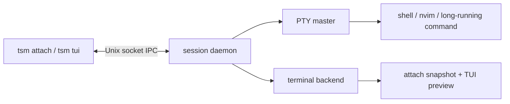
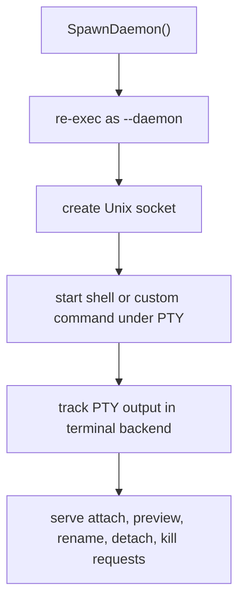
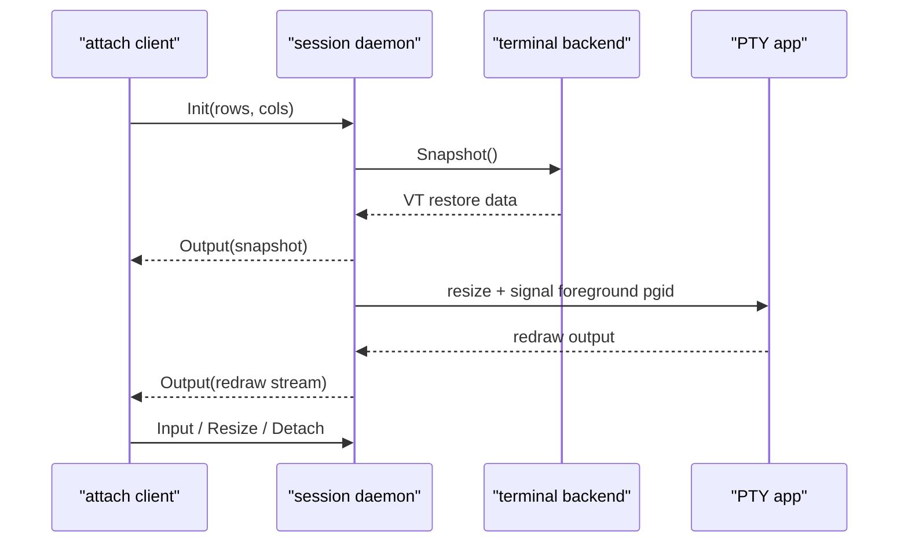
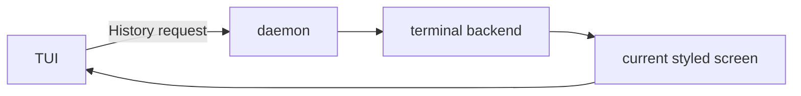

# TSM Architecture

## Overview

TSM manages persistent terminal sessions as background daemons. Each session owns a PTY, exposes a Unix socket, and tracks enough terminal state to detach and later restore the same shell or full-screen application.

At a high level:

- one daemon per session
- one PTY per session
- zero pane/window management inside `tsm`
- CLI and TUI are both thin clients over the same session daemons

## Process Model



The daemon owns the PTY. Clients connect over the Unix socket, send input and resize messages, and receive terminal output plus restore data.

## Session Lifecycle



Sessions continue running after detach. Killing a client does not kill the session. Killing the session daemon does.

## Package Layout

### `internal/session`

| File | Purpose |
| --- | --- |
| `config.go` | Socket directory resolution |
| `socket.go` | Unix socket connect/read/write helpers |
| `ipc.go` | Wire protocol tags and framing |
| `session.go` | List, rename, kill, detach control helpers |
| `daemon.go` | Daemon lifecycle, PTY, socket listener, shell integration |
| `client.go` | Interactive attach client, raw mode, resize handling, detach detection |
| `termstate.go` | Terminal backend interface and mode/state helpers |
| `terminal_backend_ghostty.go` | Ghostty VT backend for screen restore and preview |
| `switch.go` | Local session-switch control handling |
| `scrollback.go` | Raw PTY byte ring buffer fallback history |

### `internal/engine`

| File | Purpose |
| --- | --- |
| `sessions.go` | Higher-level session operations for the TUI |
| `process.go` | Process memory and uptime collection |
| `preview.go` | ANSI-aware preview cropping and width handling |

### `internal/tui`

| File | Purpose |
| --- | --- |
| `model_core.go` | TUI state, message handling, command wiring |
| `model_input.go` | Keyboard handling and TUI actions |
| `model_view.go` | Full TUI and simplified palette rendering |
| `bindings.go` | Key binding defaults, parsing, and overrides |
| `options.go` | Mode and keymap selection |
| `styles.go` | Lip Gloss styles |

### `internal/appconfig`

| File | Purpose |
| --- | --- |
| `config.go` | User config path resolution and TOML loading |
| `template.go` | Install bundled default config into user config path |
| `default_config.toml` | Embedded default config template |

### `main.go`

`main.go` is the CLI entrypoint and command router. It also resolves TUI options from:

1. built-in defaults
2. config file
3. environment
4. CLI flags

## IPC Protocol

All daemon communication uses a simple framed message format:

```text
tag:u8 + length:u32(le) + payload
```

Important tags:

- `Input` (0): client keystrokes to PTY
- `Output` (1): PTY output or restore output to client
- `Resize` (2): client terminal resize
- `Detach` (3): detach current client
- `DetachAll` (4): detach all clients
- `Kill` (5): kill daemon and session process group
- `Info` (6): session metadata
- `Init` (7): initial attach handshake
- `History` (8): preview request
- `Rename` (9): daemon-side rename request

## Attach Flow



The important detail is ordering: snapshot first, resize second. That gives full-screen apps a chance to redraw correctly after the client restores the current terminal state.

## Preview Flow



The preview is not raw scrollback replay. On the Ghostty-backed build it comes from the terminal backend's current terminal state, which preserves styling and makes the preview match the live session much more closely.

The Ghostty-backed build uses `libghostty-vt` to:

- consume PTY output continuously
- maintain the terminal state model
- serialize a VT snapshot on attach
- render the current screen for the TUI preview

This is the required backend for correct Neovim and other full-screen screen restoration.

## Agent Activity Signals

TSM also enriches session metadata for AI-agent-heavy workflows.

When the engine sees a descendant `codex` or `claude` process under a session PTY tree, it looks up a compact activity summary for that session:

- Codex: local thread state from `~/.codex/state_*.sqlite` plus the latest rollout JSONL for that thread
- Claude Code: local project session JSONL under `~/.claude/projects/...`

That data is not used to control the agent. It is only used to render a short status line in the full TUI and simplified palette so users can see what an agent was doing before switching into that session.

## Shell Integration

For default interactive shells, the daemon generates shell integration shims.

Supported shells:

- `zsh`
- `bash`
- `fish`

Each shim provides:

- prompt prefix like `[tsm:work]`
- terminal title updates
- `$TSM_SESSION`
- `$TSM_SHELL_INTEGRATION`
- `Ctrl+P` binding to open the simplified palette

The integration is session-local. Fresh sessions pick up the current integration logic. Existing running sessions keep the shell environment they started with.

## Rename Handling

Session rename is a daemon-side IPC operation, not just a socket filename rename.

That matters because rename updates:

- the socket path
- daemon session name state
- shell integration session-name file
- prompt/title rendering for fresh prompts

Without daemon-side rename, the picker and shell prompt can drift out of sync.

## TUI Modes

TSM has two TUI layouts:

- `full`: list + preview + activity log
- `simplified`: centered list-only palette

They share the same action model:

- attach
- detach
- kill
- rename
- copy attach command
- new session
- refresh
- sort
- filter

The active keymap applies identically to both layouts.

## TUI Config Resolution

Config precedence:

1. built-in defaults from `internal/tui/bindings.go`
2. `~/.config/tsm/config.toml`
3. environment variables
4. CLI flags

Supported environment overrides:

- `TSM_TUI_MODE`
- `TSM_TUI_KEYMAP`
- `TSM_CONFIG_FILE`

Supported config behaviors:

- choose default layout: `full` or `simplified`
- choose default keymap: `default` or `palette`
- hide help: `show_help = false`
- override bindings per action under `[tui.keymaps.default]` and `[tui.keymaps.palette]`

## Local Session Switch

When `tsm attach other-session` is run from inside an already attached session, TSM does not open a nested attach inside the current PTY.

Instead:

1. the inner CLI detects `$TSM_SESSION`
2. it emits a private local switch control sequence
3. the outer attach client intercepts it
4. the client reconnects to the target session

This is what makes palette-based switching from inside an attached session work like a real session switch instead of a nested terminal.

## Release Model

- bundled release archives ship `tsm` plus `libghostty-vt`
- Homebrew is served from the `adibhanna/tsm` tap, not `homebrew/core`
- source builds require `libghostty-vt` via `pkg-config`
- `make release` produces a self-contained current-platform archive
